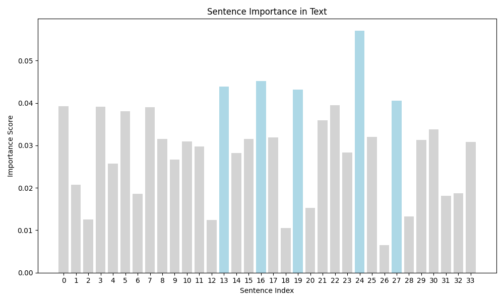
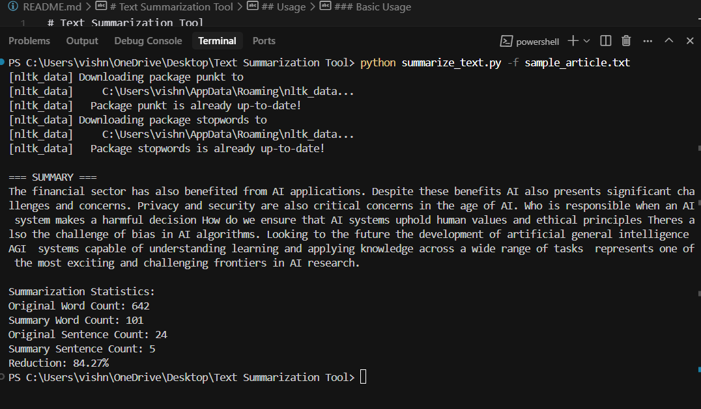

# Text Summarization Tool

*COMPANY*: CODTECH IT SOLUTIONS

*NAME*: PALADUGU VISHNU VARDHAN

*INTERN ID*: CODF32

*DOMAIN*: ARTIFICIAL INTELLIGENCE 

*DURATION*: 4 WEEEKS

*MENTOR*: NEELA SANTOSH KUMAR


A Python-based natural language processing tool that summarizes lengthy articles into concise, meaningful summaries.

## Features

- **Extractive Summarization**: Identifies and extracts the most important sentences from the text using graph-based ranking algorithms.
- **Command-line Interface**: Easy-to-use CLI for processing texts and files.
- **Visualization**: Generate visualizations showing the importance of each sentence in the text.
- **Statistics**: Get detailed statistics about the summarization process.

## How It Works

This tool implements a graph-based extractive summarization approach:

1. **Preprocessing** → Cleaning and normalizing text
2. **Tokenization** → Breaking text into sentences and words
3. **Similarity Analysis** → Computing relationships between sentences
4. **Ranking** → Using PageRank to identify key sentences
5. **Selection** → Extracting top sentences for the final summary

## Quick Start

```bash
# Install dependencies
pip install -r requirements.txt

# Summarize from a file
python summarize_text.py -f sample_article.txt

# Summarize text directly
python summarize_text.py -t "Your text here..." -o output.txt
```

## Command Options

| Option | Description |
|--------|-------------|
| `-t, --text` | Text to summarize |
| `-f, --file` | File containing text to summarize |
| `-o, --output` | Output file to save summary |
| `-n, --num-sentences` | Number of sentences in summary (default: 5) |
| `-v, --visualize` | Generate visualization of sentence importance |

## Using as a Module

```python
from text_summarizer import extractive_summarize

# Generate a 3-sentence summary
text = "Your lengthy text here..."
summary = extractive_summarize(text, num_sentences=3)
print(summary)
```

## Example Output

### Original Article
A sample article about artificial intelligence (~650 words)

### Generated Summary
```
Artificial Intelligence (AI) refers to the simulation of human intelligence in machines that are programmed to think like humans and mimic their actions.
Machine learning, a subset of AI, focuses on the development of computer programs that can access data and use it to learn for themselves.
In healthcare, AI applications can help doctors make better diagnoses, develop treatment plans, and even discover new drugs.
Looking to the future, the development of artificial general intelligence (AGI) represents one of the most exciting and challenging frontiers in AI research.
In conclusion, artificial intelligence represents one of the most transformative technologies of our time.
```

### Visualization



## Requirements

- Python 3.6+
- Dependencies: nltk, numpy, networkx, matplotlib

## License

MIT License

## Contributing

Contributions are welcome! Please feel free to submit a Pull Request.

1. Fork the repository
2. Create your feature branch (`git checkout -b feature/amazing-feature`)
3. Commit your changes (`git commit -m 'Add some amazing feature'`)
4. Push to the branch (`git push origin feature/amazing-feature`)
5. Open a Pull Request 

# Output

